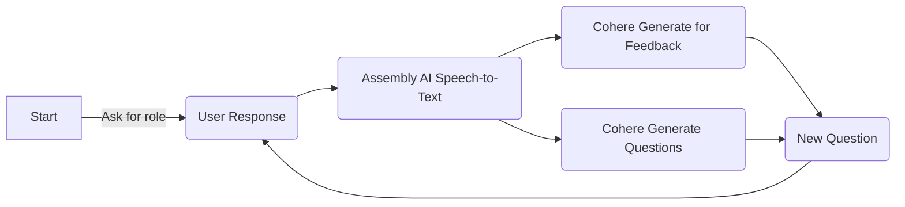

# Interviews4.tech

Hello! We are William, Grant, and Malcolm and we are here to demonstrate the applicability of Large Language Modeling (LLM) for dynamic conversations between humans and AI. This is our project for the 2022 Toronto Hackathon!

## What It Does
Our app allows users to talk to practice interviewing by answering questions on the screen and receiving feedback and new follow-up questions. It has a timing feature to allow the user to stay up to date with how quickly they answer, and it scores them on their words per minute, their rate of filler words, and their pauses in speech. It allows asks an LLM for dynamic feedback, using their response as a prompt for a holistic grade.

## How to Use

In the project directory, you can run:

### `npm run build`
> Builds the app using webpack
### `npm start`
> Launches the app on the local port while watching for changes

From there, go to http://localhost:3000 to view the app and get started!

## How it Works

### Sample Interviews! 

|                |Machine learning               |UI/UX Developemnt            |
|----------------|-------------------------------|-----------------------------|
|Question        |`What is the curse of dimensionality?`            |`What is the difference between a user interface and user experience? `           |
|Answer          |The curse of dimensionality is when we have very high dimensional data and with a large family of models we might actually fall prone to overfitting within these models period. Often this ends up forcing us to use some approaches that can behave more nicely with this data such as dimensionality reduction or feature engineering or feature selection. Also, there's been some interest in some success in certain inductive models. For example, CNN have some inductive bias in the hierarchical filter selection and this allows them to work with images. When other models such as multi layer perceptrons might not be as successful. |To me, a user interface is a web page looking like I want it to look, you know, when a member of or a user of my website joins the page, I want them to sort of of feel like the page is doing what it should do. And then a user experience to me is more like when the user tries to navigate my page or perform some action on my page. Is that doing what they expected to do? Is the flow what they're expected to do.|         
|Feedback        | You are speaking a little too slow. You spoke at 124 words per minute. You want to speak from 125-165 words per minute. You had almost no pauses. Please note that it can be helpful to use pauses to prevent monotonous speech. You had almost no filler words! Great job! This is a great response. The candidate has a deep understanding of the curse of dimensionality and how to mitigate it. They provide several examples of ways to work with high dimensional data.|You are speaking a little too slow. You spoke at 120 words per minute. You want to speak from 125-165 words per minute. You had almost no pauses. Please note that it can be helpful to use pauses to prevent monotonous speech. You had almost no filler words! Great job! This response is incomplete. The candidate should discuss the different aspects of each field and how they work together to create a cohesive product.            |
|Question        |`So would you say that the curse of dimensionality is more of a problem with certain types of models?`            |`Can you give me an example of a time when you had to improve the user experience on a project?`            |
|Answer          |Yeah, I would say that the curse of dimensionality is a problem with certain types of models, but I might adjust that statement and say more so that we can use certain types of models as well as different approaches like regularization like data augmentation to mitigate the effects of the cursive dimensionality. Anytime we're trying to fit some low dimensional signal on some high dimensional data, there's going to be spurious correlations that we can overfit. Restricting the spurious correlations that we're allowing our model to fit to is just one approach that certain types of models being architected in a certain way solves.           |Absolutely. Recently, in a hackathon for Toronto, University of Toronto, I made a project that allowed users to have online interviews with a robot, actually. And, you know, in order to, to make sure the user experience was good, we wanted to make sure that we could have some speech to text system rather than just having the user type their responses. It feels much more natural for someone to speak as a response to an interview question rather than type it out. I think it also forces the users of the Web page to really practice quality interview skills. Thinking on their feet, taking maybe a moment beforehand to plan their response to is very important, which is why we added things such as a timer beforehand to encourage the user to take some time to think.            |
|Feedback        |This response is confusing and does not directly answer the question. The candidate could have given a simpler example and discussed how the curse of dimensionality affects different types of models.|This response answers the question. The candidate should discusses a specific project where they had to improve the user experience and how they went about doing that.|
  

  
  
  
  
